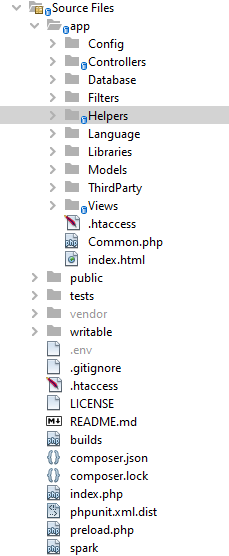

# Codeigniter

# What is Codeigniter

Codeigniter is an Application Development Framework - a toolkit - for people who build websites using PHP.

# How to install/use code igniter

To use code igniter we can install it manually or preferred using **composer.**

```bash
composer create-project codeigniter4/appstarter <project-folder-name>
```

# Application Structure



# MVC Architecture

CodeIgniter uses the Model, View, Controller (MVC) pattern to organize the files. This keeps the data, the presentation, and the flow through the application as separate parts.

**Models** manage the application's data and help enforce any special business rules the application might need.

**Views** are simple files, with little to no logic, that display the information to the user.

**Controllers** act as glue code, marshalling data back and forth between the view (or the user that’s seeing it) and
the data storage.

# URLs

There are two types of URLs available

- Query String-based URL (not supported/preferred by Codeigniter)
    
    → https://example.com/view.php?product=20
    
- Segment-based URL
    
    →  https://example.com/view/product/20
    
    → https://example.com/class/method/id
    

### what is URL?

URL =  base URL  + URI

[https://example.com](https://example.com) → base URL

view/product/20 → URI

# Controllers in Codeigniter

A controller is a class file saved in **app/Controllers** folder.

Controller extends the parent controller class so that it can inherit all its methods.

```php
<?php
namespace App\Controllers;
use CodeIgniter\Controller;

class Home extends Controller
{
    public function index()
    {
        return view('home');
    }
}
```

# What is Remapping in Codeigniter

if your controller contains a method named _remap(), it will always get called regardless of what your URI contains. It is useful to redirect if no method is available for a specific route. 

```php
<?php
namespace App\Controllers;
use CodeIgniter\Controller;

class Home extends Controller {
    public function index() {
        return view('home');
    }
    public function welcome(){
        return view('welcome_message');
    }
    public function _remap($method) {
        if (method_exists($this, $method)) {
            return $this->$method;
        } else {
            return $this->index();
        }
    }
}
```

if we call 

- [https://localhost/PASCO/](https://localhost/PASCO/)home → render home.
- [https://localhost/PASCO/](https://localhost/PASCO/)home/welcome → render welcome_message.
- [https://localhost/PASCO/](https://localhost/PASCO/)home/user → render home (because the user method does not exist, it will redirect to home).

# Views in Codeigniter

The view is the front end of a web application.

we can embed views with other views also 

file location for views is **app/Views.**

```php
<!doctype html>
<html>
    <head>
        <title>Test</title>
    </head>
    <body>
        <h1>Hello User</h1>
    </body>
</html>
```

# Passing Data in Views

Using the controller we can pass data into a view

Data is passed from the controller to the view by way of an array in the second parameter of the view function.

```php
<?php
namespace App\Controllers;
use CodeIgniter\Controller;

class User extends Controller {
    public function index() {
        $data = ['title' => 'my_title',
            'username' => 'arka'];
        return view('user',$data);
    }
}
```

```php
<!doctype html>
<html>
    <head>
        <title><?= $title?></title>
    </head>
    <body>
        <h1><?= $username?></h1>
    </body>
</html>
```

# View Parser Class

It performs simple text substitution for pseudo-variables. It can not contain any PHP file.

```php
<?php

namespace App\Controllers;

use CodeIgniter\Controller;

class User extends Controller {

    public function index() {
        $parser = \Config\Services::parser();
        $data = ['title' => 'my_title',
            'username' => 'arka'];
        $parser->setData($data);
        return $parser->render('user');
    }

}
```

```php
<!doctype html>
<html>
    <head>
        <title>{title}</title>
    </head>
    <body>
        <h1>{username}</h1>
    </body>
</html>
```

# What are Helpers in Codeigniter

A helper is a group of functions under a specific category, that helps with tasks while developing a web application

Some of the predefined helper functions

- URL Helper
- Cookie Helper
- File Helper

Extending helpers are available in **app/Helpers/**

Predefined helpers are available in **system/Helpers/**

### Load Helper

To load a helper use the global function “**helper(”name of the helper”)**”

```php
<?php

namespace App\Controllers;
use CodeIgniter\Controller;

class TestHelper extends Controller {
    public function index() {
				//you can use one by one 
        helper('form');
        helper('date');
        helper('url');
				//or you can use array         
        helper(['form', 'date', 'url']);
    }
}
```

### Extend Helper

To extend a helper we have to make a file with the same name in the folder **App/Helpers**

```php
<?php
function getRandomNumber($arr) {
    shuffle($arr);
    return end($arr);
}
```

# How to use the database in CodeIgniter